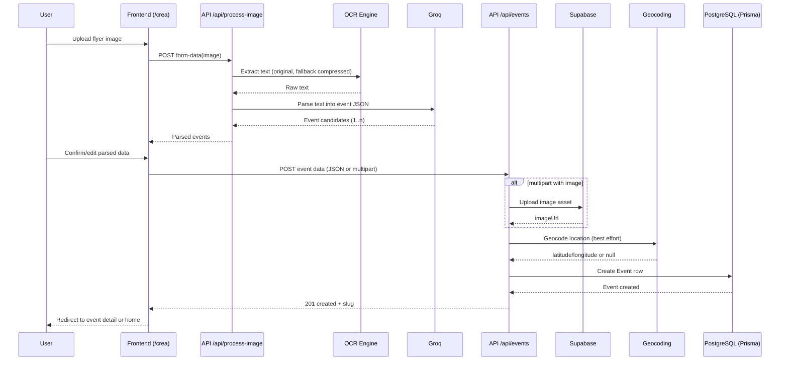
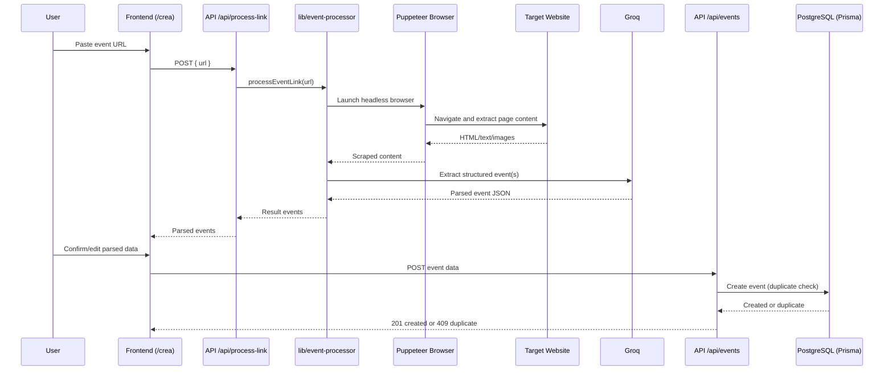
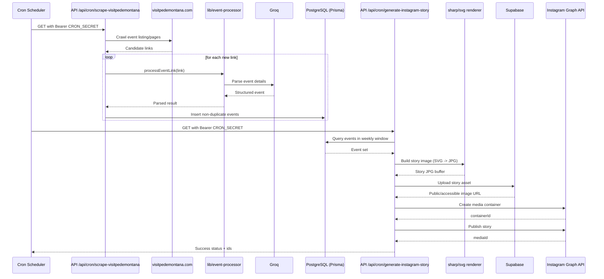

# EventScanner - Sequence Diagrams

Last update: 2026-05-27

## 1) Image OCR -> Parse -> Save

## 2) Link Scraping -> Parse -> Save

## 3) Cron Scrape + Instagram Story Publish

## Notes

- Diagrams model current behavior observed in route handlers and libs, not an aspirational architecture.
- Exact retries/timeouts and fallback branches are simplified for readability.
